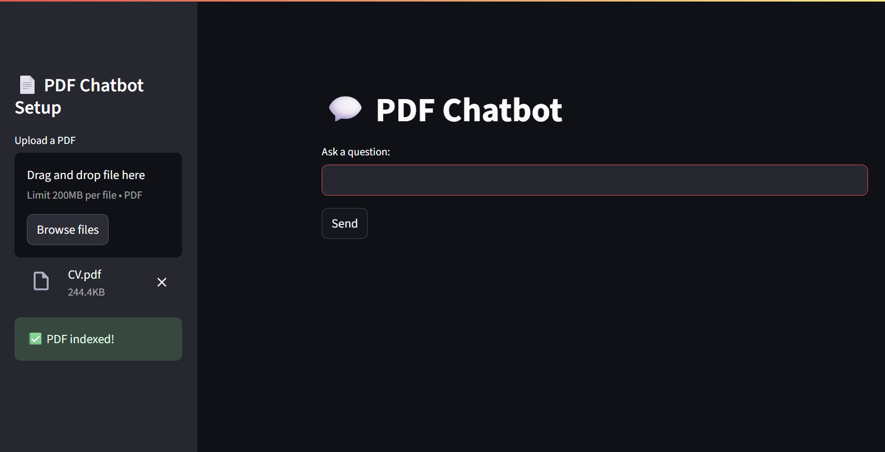

# ChatMyPDF - PDF Chatbot with RAG & LLM 🤖

ChatMyPDF is a completely free, local-first chatbot application that lets you interact with your PDFs using natural language. It uses Retrieval-Augmented Generation (RAG), FAISS vector indexing, and a locally running Large Language Model (Mistral 7B via llama.cpp). Built with LangChain and Streamlit.

  

## 🚀 Features

* 🔍 Ask questions about any PDF
* 📂 Loads & chunks PDF text automatically
* 👩‍💻 Fully local: No API keys, no internet required
* ⚖️ Uses SentenceTransformer for embeddings ("all-MiniLM-L6-v2")
* ⛏️ FAISS for vector similarity search
* 🧐 Mistral 7B Instruct model (GGUF) for response generation
* 🌍 Streamlit front-end

## 📚 Tech Stack

| Component      | Library / Tool                |
| -------------- | ----------------------------- |
| PDF Extraction | PyPDF2                        |
| Text Splitting | LangChain                     |
| Embeddings     | SentenceTransformers          |
| Vector Search  | FAISS                         |
| LLM            | llama-cpp-python (Mistral 7B) |
| UI             | Streamlit                     |

## ♻️ RAG Pipeline Overview

1. **Load PDF**: Extract all text from user-uploaded PDF.
2. **Split Text**: Chunk it into overlapping segments.
3. **Embed Chunks**: Generate embeddings via `all-MiniLM-L6-v2`.
4. **FAISS Indexing**: Store vectors for fast retrieval.
5. **User Query**: Embed question and retrieve top-k relevant chunks.
6. **LLM Response**: Feed context + query to Mistral 7B and return answer.

## ✅ Example Use

> Upload a resume, research paper, or document. Ask:

* "Summarize this PDF"
* "What technologies were used in this project?"
* "Who is the target audience?"

## 🚨 Disclaimers

* Your model must be GGUF format (compatible with `llama-cpp-python`).
* Needs \~6GB RAM minimum.
* Tested on Windows 10 + Python 3.11.

## 💡 Future Ideas

* Multi-PDF support
* File type expansion (.docx, .txt)
* Chat history + memory
* Dockerization

